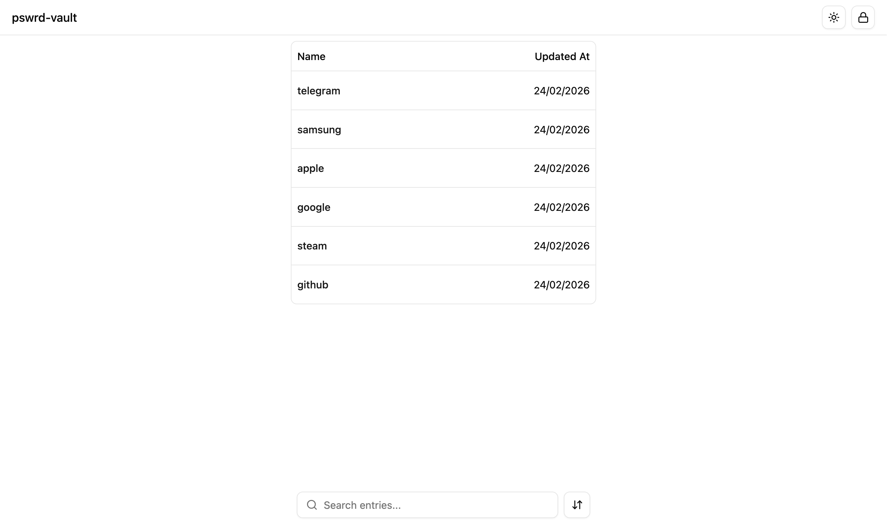

# pswrd-vault

A zero-trust, offline-first password vault that compiles into a **single self-contained HTML file**. Your credentials never leave your device — no servers, no cloud sync, no network requests. Just one portable file protected by AES-256-GCM encryption and a recovery passphrase.



---

## Table of Contents

- [Overview](#overview)
- [Usage](#usage)
- [Key Features](#key-features)
- [Architecture](#architecture)
- [How It Works](#how-it-works)
- [Development](#development)
- [Project Structure](#project-structure)
- [License](#license)

---

## Overview

**pswrd-vault** is a password manager designed around a single principle: _your secrets should exist only where you control them_. The entire vault — UI, decryption logic, and encrypted data — is bundled into one `.html` file that runs entirely in the browser with zero external dependencies or network access.

The tool consists of two parts:

| Component            | Purpose                                                                            | Runtime               |
| -------------------- | ---------------------------------------------------------------------------------- | --------------------- |
| **Encrypter** (CLI)  | Manage vault entries (add, view, delete) and produce the final encrypted HTML file | [Bun](https://bun.sh) |
| **Viewer** (Web App) | Unlock and browse your vault in any modern browser                                 | Browser (offline)     |

---

## Usage

### Downloading a Release

1. Go to the [Releases](https://github.com/OctupusPrime/pswrd-vault/releases) page.
2. Download the latest release archive for your preferred passphrase length:
   - **`pswrd-vault-12-words`** — 12-word passphrase (standard security)
   - **`pswrd-vault-24-words`** — 24-word passphrase (higher security)
3. Extract the archive. Inside you will find `app.js` and a `vaults/` directory.

### Running the CLI

Make sure you have [Node.js](https://nodejs.org) (v18+) installed, then run:

```bash
node app.js
```

This launches the interactive vault CLI. The CLI will guide you through the following steps:

#### 1. Enter Your Recovery Passphrase

You will be prompted to enter your passphrase **one word at a time**. Each word is masked for security. If no vault file exists yet, a new empty vault will be created automatically.

#### 2. Main Menu

After entering your passphrase, the main menu is displayed:

```
? What do you want to do?
❯ Add entry
  View entry
  Delete entry
  Save vault
  Exit
```

#### 3. Adding an Entry

Select **Add entry** and type a name for the entry (e.g., `GitHub`, `AWS Console`). The entry is created and you return to the main menu.

#### 4. Adding Items to an Entry

Select **View entry** → choose the entry you just created. You will see a sub-menu:

```
? What do you want to do with this entry?
❯ Add item
  View items
  Delete item
  Back to main menu
```

Select **Add item** and provide:

| Prompt         | Description                                                                            |
| -------------- | -------------------------------------------------------------------------------------- |
| **Item name**  | A label for the item (e.g., `username`, `password`, `recovery-key`)                    |
| **Item type**  | `Public` — stored as plaintext; `Secret` — individually encrypted with your passphrase |
| **Item value** | The actual value. Type the value and press Enter on an empty line to finish            |

You can add as many items as you need to a single entry.

#### 5. Viewing Items

From the entry sub-menu, select **View items** to list all items. Secret items display `*****` instead of their value.

#### 6. Deleting Items & Entries

- **Delete item** — From the entry sub-menu, select **Delete item**, choose the item, and confirm.
- **Delete entry** — From the main menu, select **Delete entry**, choose the entry, and confirm.

#### 7. Saving the Vault

Select **Save vault** from the main menu. The vault is encrypted and written to disk. The CLI also generates the final self-contained `.html` file in the `vaults/` directory alongside a `.sha256` integrity hash.

#### 8. Exiting

Select **Exit**. All sensitive data (passphrase buffers, vault contents) is securely cleared from memory.

### Opening Your Vault in the Browser

Open the generated `vaults/vault-YYYY-MM-DD.html` file in any modern browser — **no server required**. Enter your passphrase word by word to unlock and browse your entries.

### Verifying Integrity

```bash
cd vaults
shasum -a 256 -c vault-YYYY-MM-DD.html.sha256
```

---

## Key Features

- **Single-file output** — The entire vault compiles into one `.html` file via [vite-plugin-singlefile](https://github.com/nickreese/vite-plugin-singlefile). No external assets, scripts, or stylesheets.
- **AES-256-GCM encryption** — Vault data and individual secret items are encrypted using AES-256-GCM with PBKDF2 key derivation (600,000 iterations, SHA-256).
- **Double encryption** — The vault file is encrypted as a whole, and each secret item is additionally encrypted independently. Even after unlocking the vault, secrets must be explicitly revealed.
- **Zero network access** — The HTML file blocks `fetch`, `XMLHttpRequest`, `WebSocket`, `EventSource`, `sendBeacon`, and `window.open` at load time. A strict Content Security Policy (`default-src 'none'`) is injected at build time.
- **Auto-lock** — The viewer automatically locks after 5 minutes of inactivity, clearing all sensitive data from memory.
- **Memory safety** — Passphrase buffers are zeroed out after use in both the CLI and the browser.
- **SHA-256 integrity verification** — Every build produces a `.sha256` hash file so you can verify the vault file has not been tampered with.

---

## Architecture

```
┌─────────────────────────────────────────────────────────┐
│                     Encrypter (CLI)                     │
│                                                         │
│  vault-cli.ts ──► Manage entries & items                │
│  index.ts     ──► Encrypt vault → Embed into HTML       │
│  build.ts     ──► Bundle CLI for distribution           │
└──────────────────────┬──────────────────────────────────┘
                       │
                       ▼
              ┌────────────────┐
              │  vault-YYYY-   │
              │  MM-DD.html    │  ← Self-contained vault file
              └────────────────┘
                       │
                       ▼
┌─────────────────────────────────────────────────────────┐
│                    Viewer (Browser)                     │
│                                                         │
│  Login ──► Decrypt vault with passphrase                │
│  List  ──► Browse entries                               │
│  View  ──► Reveal individual secrets on demand          │
└─────────────────────────────────────────────────────────┘
```

---

## How It Works

### 1. Managing Vault Content (Encrypter CLI)

The CLI walks you through managing your vault interactively:

1. **Enter your recovery passphrase** — word by word (each word is masked).
2. **Add entries** — Each entry (e.g., "GitHub", "AWS Console") can hold multiple items.
3. **Add items to entries** — Items are either `public` (stored in plaintext) or `secret` (individually encrypted).
4. **Save the vault** — Encrypts everything and writes the binary vault file.
5. **Build the HTML** — The encrypted vault data is embedded into the compiled Svelte viewer, producing a single `.html` file.

### 2. Viewing Vault Content (Browser)

1. Open the generated `.html` file in any modern browser.
2. Enter your recovery passphrase word by word.
3. Browse your entries and search through them.
4. Click on an entry to view its items — secret values stay hidden until you explicitly reveal them.
5. The vault auto-locks after 5 minutes of inactivity.

---

## Development

Development requires running **two processes in sequence**: the encrypter CLI first (to create/manage a local vault file), then the viewer dev server (to display it in the browser).

### Prerequisites

- [Bun](https://bun.sh) (v1.0+) — required for the encrypter CLI
- [Node.js](https://nodejs.org) (v18+) — required for the viewer build
- [pnpm](https://pnpm.io) — package manager for the viewer

### Step 1 - Install Dependencies

```bash
# Install encrypter dependencies
cd encrypter && bun install && cd ..

# Install viewer dependencies
cd viewer && pnpm install && cd ..
```

### Step 2 — Start the Encrypter (CLI)

```bash
npm run dev-encrypter
```

This runs the vault CLI in development mode. It reads/writes the vault file to `viewer/src/assets/vault.bin` so the viewer can import it directly during development.

Use the interactive CLI to add or modify entries, then **save** and **exit**.

### Step 3 — Start the Viewer (Dev Server)

```bash
npm run dev-viewer
```

This starts the Vite dev server with hot module replacement. Open the URL shown in the terminal (typically `http://localhost:5173`) and enter your passphrase to view the vault.

> **Note:** You must run the encrypter first to ensure `viewer/src/assets/vault.bin` exists. The viewer will fail to start if the vault file is missing.

---

## Project Structure

```
pswrd-vault/
├── package.json                # Root scripts (dev & build commands)
├── README.md
├── encrypter/                  # CLI tool (Bun + TypeScript)
│   ├── src/
│   │   ├── index.ts            # Entry point — orchestrates encryption & HTML embedding
│   │   └── vault-cli.ts        # Interactive CLI for managing vault entries & items
│   ├── build.ts                # Production bundler (Bun.build)
│   └── package.json
├── viewer/                     # Web UI (Svelte 5 + Vite + TailwindCSS)
│   ├── src/
│   │   ├── main.ts             # App bootstrap
│   │   ├── App.svelte          # Root component
│   │   ├── features/           # Feature-based modules
│   │   │   ├── login-form/     # Passphrase input form
│   │   │   ├── navigation/     # Header & navigation
│   │   │   ├── vault-entries-list/  # Entry listing & search
│   │   │   └── view-entry-item/    # Entry detail view
│   │   ├── lib/
│   │   │   ├── consts.ts       # App constants (timeouts, passphrase length)
│   │   │   ├── stores/
│   │   │   │   └── vault.svelte.ts  # Vault state & decryption logic (Web Crypto API)
│   │   │   └── components/ui/  # Reusable UI components
│   │   └── router/             # File-based routing
│   ├── index.html              # HTML template with network-blocking scripts
│   └── vite.config.ts          # Vite config (singlefile plugin, CSP injection)
└── dist-{n}-words/             # Production build output
    ├── app.js                  # Bundled CLI
    ├── app.js.sha256            # CLI integrity hash
    └── vaults/
        ├── vault-YYYY-MM-DD.html       # Self-contained vault file
        └── vault-YYYY-MM-DD.html.sha256 # Vault integrity hash
```

---

## License

This project is licensed under the [MIT License](./LICENSE).
